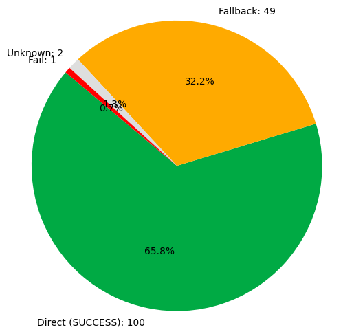

# ONNXRuntime Test Results — Provider: `DmlExecutionProvider`

**Test Date:** 2025-06-06 17:56:42

## Environment and Installation Details

- **ONNX version:** 1.18.0
- **ONNXRuntime version:** 1.22.0
- **Target provider:** DmlExecutionProvider
- **Installation command:**
```bash
pip install onnxruntime-directml
```
### Hardware and Software Versions

- **CPU:** Intel(R) Core(TM) i7-9700 CPU @ 3.00GHz

## Node Details

| ONNX Node | Status |
|:---------:|:------:|
| [`Add`](https://onnx.ai/onnx/operators/onnx__Add.html) |  |
| [`AffineGrid`](https://onnx.ai/onnx/operators/onnx__AffineGrid.html) |  |
| [`And`](https://onnx.ai/onnx/operators/onnx__And.html) |  |
| [`ArgMax`](https://onnx.ai/onnx/operators/onnx__ArgMax.html) |  |
| [`ArgMin`](https://onnx.ai/onnx/operators/onnx__ArgMin.html) |  |
| [`AveragePool`](https://onnx.ai/onnx/operators/onnx__AveragePool.html) |  |
| [`BatchNormalization`](https://onnx.ai/onnx/operators/onnx__BatchNormalization.html) |  |
| [`Bernoulli`](https://onnx.ai/onnx/operators/onnx__Bernoulli.html) |  |
| [`BitShift`](https://onnx.ai/onnx/operators/onnx__BitShift.html) |  |
| [`BitwiseAnd`](https://onnx.ai/onnx/operators/onnx__BitwiseAnd.html) |  |
| [`BitwiseNot`](https://onnx.ai/onnx/operators/onnx__BitwiseNot.html) |  |
| [`BitwiseOr`](https://onnx.ai/onnx/operators/onnx__BitwiseOr.html) |  |
| [`BitwiseXor`](https://onnx.ai/onnx/operators/onnx__BitwiseXor.html) |  |
| [`BlackmanWindow`](https://onnx.ai/onnx/operators/onnx__BlackmanWindow.html) |  |
| [`Cast`](https://onnx.ai/onnx/operators/onnx__Cast.html) |  |
| [`CastLike`](https://onnx.ai/onnx/operators/onnx__CastLike.html) |  |
| [`CenterCropPad`](https://onnx.ai/onnx/operators/onnx__CenterCropPad.html) |  |
| [`Clip`](https://onnx.ai/onnx/operators/onnx__Clip.html) |  |
| [`Col2Im`](https://onnx.ai/onnx/operators/onnx__Col2Im.html) |  |
| [`Compress`](https://onnx.ai/onnx/operators/onnx__Compress.html) |  |
| [`Concat`](https://onnx.ai/onnx/operators/onnx__Concat.html) |  |
| [`ConcatFromSequence`](https://onnx.ai/onnx/operators/onnx__ConcatFromSequence.html) |  |
| [`Constant`](https://onnx.ai/onnx/operators/onnx__Constant.html) |  |
| [`ConstantOfShape`](https://onnx.ai/onnx/operators/onnx__ConstantOfShape.html) |  |
| [`Conv`](https://onnx.ai/onnx/operators/onnx__Conv.html) |  |
| [`ConvInteger`](https://onnx.ai/onnx/operators/onnx__ConvInteger.html) |  |
| [`ConvTranspose`](https://onnx.ai/onnx/operators/onnx__ConvTranspose.html) |  |
| [`CumSum`](https://onnx.ai/onnx/operators/onnx__CumSum.html) |  |
| [`DFT`](https://onnx.ai/onnx/operators/onnx__DFT.html) |  |
| [`DeformConv`](https://onnx.ai/onnx/operators/onnx__DeformConv.html) |  |
| [`DepthToSpace`](https://onnx.ai/onnx/operators/onnx__DepthToSpace.html) |  |
| [`DequantizeLinear`](https://onnx.ai/onnx/operators/onnx__DequantizeLinear.html) |  |
| [`Det`](https://onnx.ai/onnx/operators/onnx__Det.html) |  |
| [`Div`](https://onnx.ai/onnx/operators/onnx__Div.html) |  |
| [`Dropout`](https://onnx.ai/onnx/operators/onnx__Dropout.html) |  |
| [`DynamicQuantizeLinear`](https://onnx.ai/onnx/operators/onnx__DynamicQuantizeLinear.html) |  |
| [`Einsum`](https://onnx.ai/onnx/operators/onnx__Einsum.html) |  |
| [`Equal`](https://onnx.ai/onnx/operators/onnx__Equal.html) |  |
| [`Expand`](https://onnx.ai/onnx/operators/onnx__Expand.html) |  |
| [`EyeLike`](https://onnx.ai/onnx/operators/onnx__EyeLike.html) |  |
| [`Flatten`](https://onnx.ai/onnx/operators/onnx__Flatten.html) |  |
| [`GRU`](https://onnx.ai/onnx/operators/onnx__GRU.html) |  |
| [`Gather`](https://onnx.ai/onnx/operators/onnx__Gather.html) |  |
| [`GatherElements`](https://onnx.ai/onnx/operators/onnx__GatherElements.html) |  |
| [`GatherND`](https://onnx.ai/onnx/operators/onnx__GatherND.html) |  |
| [`Gelu`](https://onnx.ai/onnx/operators/onnx__Gelu.html) |  |
| [`Gemm`](https://onnx.ai/onnx/operators/onnx__Gemm.html) |  |
| [`GlobalAveragePool`](https://onnx.ai/onnx/operators/onnx__GlobalAveragePool.html) |  |
| [`GlobalMaxPool`](https://onnx.ai/onnx/operators/onnx__GlobalMaxPool.html) |  |
| [`Greater`](https://onnx.ai/onnx/operators/onnx__Greater.html) |  |
| [`GreaterOrEqual`](https://onnx.ai/onnx/operators/onnx__GreaterOrEqual.html) |  |
| [`GridSample`](https://onnx.ai/onnx/operators/onnx__GridSample.html) |  |
| [`GroupNormalization`](https://onnx.ai/onnx/operators/onnx__GroupNormalization.html) |  |
| [`HammingWindow`](https://onnx.ai/onnx/operators/onnx__HammingWindow.html) |  |
| [`HannWindow`](https://onnx.ai/onnx/operators/onnx__HannWindow.html) |  |
| [`HardSigmoid`](https://onnx.ai/onnx/operators/onnx__HardSigmoid.html) |  |
| [`HardSwish`](https://onnx.ai/onnx/operators/onnx__HardSwish.html) |  |
| [`Hardmax`](https://onnx.ai/onnx/operators/onnx__Hardmax.html) |  |
| [`Identity`](https://onnx.ai/onnx/operators/onnx__Identity.html) |  |
| [`If`](https://onnx.ai/onnx/operators/onnx__If.html) |  |
| [`ImageDecoder`](https://onnx.ai/onnx/operators/onnx__ImageDecoder.html) |  |
| [`InstanceNormalization`](https://onnx.ai/onnx/operators/onnx__InstanceNormalization.html) |  |
| [`IsInf`](https://onnx.ai/onnx/operators/onnx__IsInf.html) |  |
| [`IsNaN`](https://onnx.ai/onnx/operators/onnx__IsNaN.html) |  |
| [`LRN`](https://onnx.ai/onnx/operators/onnx__LRN.html) |  |
| [`LSTM`](https://onnx.ai/onnx/operators/onnx__LSTM.html) |  |
| [`LayerNormalization`](https://onnx.ai/onnx/operators/onnx__LayerNormalization.html) |  |
| [`Less`](https://onnx.ai/onnx/operators/onnx__Less.html) |  |
| [`LessOrEqual`](https://onnx.ai/onnx/operators/onnx__LessOrEqual.html) |  |
| [`Loop`](https://onnx.ai/onnx/operators/onnx__Loop.html) |  |
| [`LpNormalization`](https://onnx.ai/onnx/operators/onnx__LpNormalization.html) |  |
| [`LpPool`](https://onnx.ai/onnx/operators/onnx__LpPool.html) |  |
| [`MatMul`](https://onnx.ai/onnx/operators/onnx__MatMul.html) |  |
| [`MatMulInteger`](https://onnx.ai/onnx/operators/onnx__MatMulInteger.html) |  |
| [`Max`](https://onnx.ai/onnx/operators/onnx__Max.html) |  |
| [`MaxPool`](https://onnx.ai/onnx/operators/onnx__MaxPool.html) |  |
| [`MaxRoiPool`](https://onnx.ai/onnx/operators/onnx__MaxRoiPool.html) |  |
| [`MaxUnpool`](https://onnx.ai/onnx/operators/onnx__MaxUnpool.html) |  |
| [`Mean`](https://onnx.ai/onnx/operators/onnx__Mean.html) |  |
| [`MeanVarianceNormalization`](https://onnx.ai/onnx/operators/onnx__MeanVarianceNormalization.html) |  |
| [`MelWeightMatrix`](https://onnx.ai/onnx/operators/onnx__MelWeightMatrix.html) |  |
| [`Min`](https://onnx.ai/onnx/operators/onnx__Min.html) |  |
| [`Mod`](https://onnx.ai/onnx/operators/onnx__Mod.html) |  |
| [`Mul`](https://onnx.ai/onnx/operators/onnx__Mul.html) |  |
| [`Multinomial`](https://onnx.ai/onnx/operators/onnx__Multinomial.html) |  |
| [`NegativeLogLikelihoodLoss`](https://onnx.ai/onnx/operators/onnx__NegativeLogLikelihoodLoss.html) |  |
| [`NonMaxSuppression`](https://onnx.ai/onnx/operators/onnx__NonMaxSuppression.html) |  |
| [`NonZero`](https://onnx.ai/onnx/operators/onnx__NonZero.html) |  |
| [`Not`](https://onnx.ai/onnx/operators/onnx__Not.html) |  |
| [`Not`](https://onnx.ai/onnx/operators/onnx__Not.html) |  |
| [`OneHot`](https://onnx.ai/onnx/operators/onnx__OneHot.html) |  |
| [`Optional`](https://onnx.ai/onnx/operators/onnx__Optional.html) |  |
| [`OptionalGetElement`](https://onnx.ai/onnx/operators/onnx__OptionalGetElement.html) |  |
| [`OptionalHasElement`](https://onnx.ai/onnx/operators/onnx__OptionalHasElement.html) |  |
| [`Or`](https://onnx.ai/onnx/operators/onnx__Or.html) |  |
| [`PRelu`](https://onnx.ai/onnx/operators/onnx__PRelu.html) |  |
| [`Pad`](https://onnx.ai/onnx/operators/onnx__Pad.html) |  |
| [`Pow`](https://onnx.ai/onnx/operators/onnx__Pow.html) |  |
| [`QLinearConv`](https://onnx.ai/onnx/operators/onnx__QLinearConv.html) |  |
| [`QLinearMatMul`](https://onnx.ai/onnx/operators/onnx__QLinearMatMul.html) |  |
| [`QuantizeLinear`](https://onnx.ai/onnx/operators/onnx__QuantizeLinear.html) |  |
| [`RNN`](https://onnx.ai/onnx/operators/onnx__RNN.html) |  |
| [`RandomNormal`](https://onnx.ai/onnx/operators/onnx__RandomNormal.html) |  |
| [`RandomNormalLike`](https://onnx.ai/onnx/operators/onnx__RandomNormalLike.html) |  |
| [`RandomUniform`](https://onnx.ai/onnx/operators/onnx__RandomUniform.html) |  |
| [`RandomUniformLike`](https://onnx.ai/onnx/operators/onnx__RandomUniformLike.html) |  |
| [`Range`](https://onnx.ai/onnx/operators/onnx__Range.html) |  |
| [`ReduceL1`](https://onnx.ai/onnx/operators/onnx__ReduceL1.html) |  |
| [`ReduceL2`](https://onnx.ai/onnx/operators/onnx__ReduceL2.html) |  |
| [`ReduceLogSum`](https://onnx.ai/onnx/operators/onnx__ReduceLogSum.html) |  |
| [`ReduceLogSumExp`](https://onnx.ai/onnx/operators/onnx__ReduceLogSumExp.html) |  |
| [`ReduceMax`](https://onnx.ai/onnx/operators/onnx__ReduceMax.html) |  |
| [`ReduceMean`](https://onnx.ai/onnx/operators/onnx__ReduceMean.html) |  |
| [`ReduceMin`](https://onnx.ai/onnx/operators/onnx__ReduceMin.html) |  |
| [`ReduceProd`](https://onnx.ai/onnx/operators/onnx__ReduceProd.html) |  |
| [`ReduceSum`](https://onnx.ai/onnx/operators/onnx__ReduceSum.html) |  |
| [`ReduceSumSquare`](https://onnx.ai/onnx/operators/onnx__ReduceSumSquare.html) |  |
| [`RegexFullMatch`](https://onnx.ai/onnx/operators/onnx__RegexFullMatch.html) |  |
| [`Reshape`](https://onnx.ai/onnx/operators/onnx__Reshape.html) |  |
| [`Resize`](https://onnx.ai/onnx/operators/onnx__Resize.html) |  |
| [`ReverseSequence`](https://onnx.ai/onnx/operators/onnx__ReverseSequence.html) |  |
| [`RoiAlign`](https://onnx.ai/onnx/operators/onnx__RoiAlign.html) |  |
| [`STFT`](https://onnx.ai/onnx/operators/onnx__STFT.html) |  |
| [`Scan`](https://onnx.ai/onnx/operators/onnx__Scan.html) |  |
| [`ScatterElements`](https://onnx.ai/onnx/operators/onnx__ScatterElements.html) |  |
| [`ScatterND`](https://onnx.ai/onnx/operators/onnx__ScatterND.html) |  |
| [`SequenceAt`](https://onnx.ai/onnx/operators/onnx__SequenceAt.html) |  |
| [`SequenceConstruct`](https://onnx.ai/onnx/operators/onnx__SequenceConstruct.html) |  |
| [`SequenceEmpty`](https://onnx.ai/onnx/operators/onnx__SequenceEmpty.html) |  |
| [`SequenceErase`](https://onnx.ai/onnx/operators/onnx__SequenceErase.html) |  |
| [`SequenceInsert`](https://onnx.ai/onnx/operators/onnx__SequenceInsert.html) |  |
| [`SequenceLength`](https://onnx.ai/onnx/operators/onnx__SequenceLength.html) |  |
| [`SequenceMap`](https://onnx.ai/onnx/operators/onnx__SequenceMap.html) |  |
| [`Shape`](https://onnx.ai/onnx/operators/onnx__Shape.html) |  |
| [`Size`](https://onnx.ai/onnx/operators/onnx__Size.html) |  |
| [`Slice`](https://onnx.ai/onnx/operators/onnx__Slice.html) |  |
| [`SoftmaxCrossEntropyLoss`](https://onnx.ai/onnx/operators/onnx__SoftmaxCrossEntropyLoss.html) |  |
| [`SpaceToDepth`](https://onnx.ai/onnx/operators/onnx__SpaceToDepth.html) |  |
| [`Split`](https://onnx.ai/onnx/operators/onnx__Split.html) |  |
| [`SplitToSequence`](https://onnx.ai/onnx/operators/onnx__SplitToSequence.html) |  |
| [`Squeeze`](https://onnx.ai/onnx/operators/onnx__Squeeze.html) |  |
| [`StringConcat`](https://onnx.ai/onnx/operators/onnx__StringConcat.html) |  |
| [`StringNormalizer`](https://onnx.ai/onnx/operators/onnx__StringNormalizer.html) |  |
| [`StringSplit`](https://onnx.ai/onnx/operators/onnx__StringSplit.html) |  |
| [`Sub`](https://onnx.ai/onnx/operators/onnx__Sub.html) |  |
| [`Sum`](https://onnx.ai/onnx/operators/onnx__Sum.html) |  |
| [`TfIdfVectorizer`](https://onnx.ai/onnx/operators/onnx__TfIdfVectorizer.html) |  |
| [`Tile`](https://onnx.ai/onnx/operators/onnx__Tile.html) |  |
| [`TopK`](https://onnx.ai/onnx/operators/onnx__TopK.html) |  |
| [`Transpose`](https://onnx.ai/onnx/operators/onnx__Transpose.html) |  |
| [`Trilu`](https://onnx.ai/onnx/operators/onnx__Trilu.html) |  |
| [`Unique`](https://onnx.ai/onnx/operators/onnx__Unique.html) |  |
| [`Unsqueeze`](https://onnx.ai/onnx/operators/onnx__Unsqueeze.html) |  |
| [`Where`](https://onnx.ai/onnx/operators/onnx__Where.html) |  |
| [`Xor`](https://onnx.ai/onnx/operators/onnx__Xor.html) |  |
| [`com.microsoft.Attention`](https://onnx.ai/onnx/operators/onnx__com.microsoft.Attention.html) |  |
| [`com.microsoft.AttnLSTM`](https://onnx.ai/onnx/operators/onnx__com.microsoft.AttnLSTM.html) |  |
| [`com.microsoft.BeamSearch`](https://onnx.ai/onnx/operators/onnx__com.microsoft.BeamSearch.html) |  |
| [`com.microsoft.BiasAdd`](https://onnx.ai/onnx/operators/onnx__com.microsoft.BiasAdd.html) |  |
| [`com.microsoft.BiasDropout`](https://onnx.ai/onnx/operators/onnx__com.microsoft.BiasDropout.html) |  |
| [`com.microsoft.BiasGelu`](https://onnx.ai/onnx/operators/onnx__com.microsoft.BiasGelu.html) |  |
| [`com.microsoft.BiasSoftmax`](https://onnx.ai/onnx/operators/onnx__com.microsoft.BiasSoftmax.html) |  |
| [`com.microsoft.BiasSplitGelu`](https://onnx.ai/onnx/operators/onnx__com.microsoft.BiasSplitGelu.html) |  |
| [`com.microsoft.BifurcationDetector`](https://onnx.ai/onnx/operators/onnx__com.microsoft.BifurcationDetector.html) |  |
| [`com.microsoft.BitmaskBiasDropout`](https://onnx.ai/onnx/operators/onnx__com.microsoft.BitmaskBiasDropout.html) |  |
| [`com.microsoft.BitmaskDropout`](https://onnx.ai/onnx/operators/onnx__com.microsoft.BitmaskDropout.html) |  |
| [`com.microsoft.CDist`](https://onnx.ai/onnx/operators/onnx__com.microsoft.CDist.html) |  |
| [`com.microsoft.ComplexMul`](https://onnx.ai/onnx/operators/onnx__com.microsoft.ComplexMul.html) |  |
| [`com.microsoft.ComplexMulConj`](https://onnx.ai/onnx/operators/onnx__com.microsoft.ComplexMulConj.html) |  |
| [`com.microsoft.ConvTransposeWithDynamicPads`](https://onnx.ai/onnx/operators/onnx__com.microsoft.ConvTransposeWithDynamicPads.html) |  |
| [`com.microsoft.CropAndResize`](https://onnx.ai/onnx/operators/onnx__com.microsoft.CropAndResize.html) |  |
| [`com.microsoft.CropAndResize`](https://onnx.ai/onnx/operators/onnx__com.microsoft.CropAndResize.html) |  |
| [`com.microsoft.DecoderAttention`](https://onnx.ai/onnx/operators/onnx__com.microsoft.DecoderAttention.html) |  |
| [`com.microsoft.DecoderMaskedMultiHeadAttention`](https://onnx.ai/onnx/operators/onnx__com.microsoft.DecoderMaskedMultiHeadAttention.html) |  |
| [`com.microsoft.DecoderMaskedSelfAttention`](https://onnx.ai/onnx/operators/onnx__com.microsoft.DecoderMaskedSelfAttention.html) |  |
| [`com.microsoft.DequantizeBFP`](https://onnx.ai/onnx/operators/onnx__com.microsoft.DequantizeBFP.html) |  |
| [`com.microsoft.DequantizeLinear`](https://onnx.ai/onnx/operators/onnx__com.microsoft.DequantizeLinear.html) |  |
| [`com.microsoft.DequantizeWithOrder`](https://onnx.ai/onnx/operators/onnx__com.microsoft.DequantizeWithOrder.html) |  |
| [`com.microsoft.DynamicQuantizeLSTM`](https://onnx.ai/onnx/operators/onnx__com.microsoft.DynamicQuantizeLSTM.html) |  |
| [`com.microsoft.DynamicQuantizeMatMul`](https://onnx.ai/onnx/operators/onnx__com.microsoft.DynamicQuantizeMatMul.html) |  |
| [`com.microsoft.DynamicTimeWarping`](https://onnx.ai/onnx/operators/onnx__com.microsoft.DynamicTimeWarping.html) |  |
| [`com.microsoft.EmbedLayerNormalization`](https://onnx.ai/onnx/operators/onnx__com.microsoft.EmbedLayerNormalization.html) |  |
| [`com.microsoft.ExpandDims`](https://onnx.ai/onnx/operators/onnx__com.microsoft.ExpandDims.html) |  |
| [`com.microsoft.FastGelu`](https://onnx.ai/onnx/operators/onnx__com.microsoft.FastGelu.html) |  |
| [`com.microsoft.FusedConv`](https://onnx.ai/onnx/operators/onnx__com.microsoft.FusedConv.html) |  |
| [`com.microsoft.FusedGemm`](https://onnx.ai/onnx/operators/onnx__com.microsoft.FusedGemm.html) |  |
| [`com.microsoft.FusedMatMul`](https://onnx.ai/onnx/operators/onnx__com.microsoft.FusedMatMul.html) |  |
| [`com.microsoft.FusedMatMulActivation`](https://onnx.ai/onnx/operators/onnx__com.microsoft.FusedMatMulActivation.html) |  |
| [`com.microsoft.GatedRelativePositionBias`](https://onnx.ai/onnx/operators/onnx__com.microsoft.GatedRelativePositionBias.html) |  |
| [`com.microsoft.GatherBlockQuantized`](https://onnx.ai/onnx/operators/onnx__com.microsoft.GatherBlockQuantized.html) |  |
| [`com.microsoft.GatherND`](https://onnx.ai/onnx/operators/onnx__com.microsoft.GatherND.html) |  |
| [`com.microsoft.Gelu`](https://onnx.ai/onnx/operators/onnx__com.microsoft.Gelu.html) |  |
| [`com.microsoft.GemmFastGelu`](https://onnx.ai/onnx/operators/onnx__com.microsoft.GemmFastGelu.html) |  |
| [`com.microsoft.GemmFloat8`](https://onnx.ai/onnx/operators/onnx__com.microsoft.GemmFloat8.html) |  |
| [`com.microsoft.GemmaRotaryEmbedding`](https://onnx.ai/onnx/operators/onnx__com.microsoft.GemmaRotaryEmbedding.html) |  |
| [`com.microsoft.GreedySearch`](https://onnx.ai/onnx/operators/onnx__com.microsoft.GreedySearch.html) |  |
| [`com.microsoft.GridSample`](https://onnx.ai/onnx/operators/onnx__com.microsoft.GridSample.html) |  |
| [`com.microsoft.GroupNorm`](https://onnx.ai/onnx/operators/onnx__com.microsoft.GroupNorm.html) |  |
| [`com.microsoft.GroupQueryAttention`](https://onnx.ai/onnx/operators/onnx__com.microsoft.GroupQueryAttention.html) |  |
| [`com.microsoft.Inverse`](https://onnx.ai/onnx/operators/onnx__com.microsoft.Inverse.html) |  |
| [`com.microsoft.Irfft`](https://onnx.ai/onnx/operators/onnx__com.microsoft.Irfft.html) |  |
| [`com.microsoft.LongformerAttention`](https://onnx.ai/onnx/operators/onnx__com.microsoft.LongformerAttention.html) |  |
| [`com.microsoft.MatMulBnb4`](https://onnx.ai/onnx/operators/onnx__com.microsoft.MatMulBnb4.html) |  |
| [`com.microsoft.MatMulFpQ4`](https://onnx.ai/onnx/operators/onnx__com.microsoft.MatMulFpQ4.html) |  |
| [`com.microsoft.MatMulInteger16`](https://onnx.ai/onnx/operators/onnx__com.microsoft.MatMulInteger16.html) |  |
| [`com.microsoft.MatMulIntegerToFloat`](https://onnx.ai/onnx/operators/onnx__com.microsoft.MatMulIntegerToFloat.html) |  |
| [`com.microsoft.MatMulNBits`](https://onnx.ai/onnx/operators/onnx__com.microsoft.MatMulNBits.html) |  |
| [`com.microsoft.MaxpoolWithMask`](https://onnx.ai/onnx/operators/onnx__com.microsoft.MaxpoolWithMask.html) |  |
| [`com.microsoft.MoE`](https://onnx.ai/onnx/operators/onnx__com.microsoft.MoE.html) |  |
| [`com.microsoft.MulInteger`](https://onnx.ai/onnx/operators/onnx__com.microsoft.MulInteger.html) |  |
| [`com.microsoft.MultiHeadAttention`](https://onnx.ai/onnx/operators/onnx__com.microsoft.MultiHeadAttention.html) |  |
| [`com.microsoft.MurmurHash3`](https://onnx.ai/onnx/operators/onnx__com.microsoft.MurmurHash3.html) |  |
| [`com.microsoft.NGramRepeatBlock`](https://onnx.ai/onnx/operators/onnx__com.microsoft.NGramRepeatBlock.html) |  |
| [`com.microsoft.NhwcConv`](https://onnx.ai/onnx/operators/onnx__com.microsoft.NhwcConv.html) |  |
| [`com.microsoft.NhwcFusedConv`](https://onnx.ai/onnx/operators/onnx__com.microsoft.NhwcFusedConv.html) |  |
| [`com.microsoft.NhwcMaxPool`](https://onnx.ai/onnx/operators/onnx__com.microsoft.NhwcMaxPool.html) |  |
| [`com.microsoft.PackedAttention`](https://onnx.ai/onnx/operators/onnx__com.microsoft.PackedAttention.html) |  |
| [`com.microsoft.PackedMultiHeadAttention`](https://onnx.ai/onnx/operators/onnx__com.microsoft.PackedMultiHeadAttention.html) |  |
| [`com.microsoft.Pad`](https://onnx.ai/onnx/operators/onnx__com.microsoft.Pad.html) |  |
| [`com.microsoft.QAttention`](https://onnx.ai/onnx/operators/onnx__com.microsoft.QAttention.html) |  |
| [`com.microsoft.QGemm`](https://onnx.ai/onnx/operators/onnx__com.microsoft.QGemm.html) |  |
| [`com.microsoft.QLinearAdd`](https://onnx.ai/onnx/operators/onnx__com.microsoft.QLinearAdd.html) |  |
| [`com.microsoft.QLinearAveragePool`](https://onnx.ai/onnx/operators/onnx__com.microsoft.QLinearAveragePool.html) |  |
| [`com.microsoft.QLinearConcat`](https://onnx.ai/onnx/operators/onnx__com.microsoft.QLinearConcat.html) |  |
| [`com.microsoft.QLinearConv`](https://onnx.ai/onnx/operators/onnx__com.microsoft.QLinearConv.html) |  |
| [`com.microsoft.QLinearGlobalAveragePool`](https://onnx.ai/onnx/operators/onnx__com.microsoft.QLinearGlobalAveragePool.html) |  |
| [`com.microsoft.QLinearLeakyRelu`](https://onnx.ai/onnx/operators/onnx__com.microsoft.QLinearLeakyRelu.html) |  |
| [`com.microsoft.QLinearMul`](https://onnx.ai/onnx/operators/onnx__com.microsoft.QLinearMul.html) |  |
| [`com.microsoft.QLinearReduceMean`](https://onnx.ai/onnx/operators/onnx__com.microsoft.QLinearReduceMean.html) |  |
| [`com.microsoft.QLinearSigmoid`](https://onnx.ai/onnx/operators/onnx__com.microsoft.QLinearSigmoid.html) |  |
| [`com.microsoft.QLinearSoftmax`](https://onnx.ai/onnx/operators/onnx__com.microsoft.QLinearSoftmax.html) |  |
| [`com.microsoft.QLinearWhere`](https://onnx.ai/onnx/operators/onnx__com.microsoft.QLinearWhere.html) |  |
| [`com.microsoft.QMoE`](https://onnx.ai/onnx/operators/onnx__com.microsoft.QMoE.html) |  |
| [`com.microsoft.QOrderedAttention`](https://onnx.ai/onnx/operators/onnx__com.microsoft.QOrderedAttention.html) |  |
| [`com.microsoft.QOrderedGelu`](https://onnx.ai/onnx/operators/onnx__com.microsoft.QOrderedGelu.html) |  |
| [`com.microsoft.QOrderedLayerNormalization`](https://onnx.ai/onnx/operators/onnx__com.microsoft.QOrderedLayerNormalization.html) |  |
| [`com.microsoft.QOrderedLongformerAttention`](https://onnx.ai/onnx/operators/onnx__com.microsoft.QOrderedLongformerAttention.html) |  |
| [`com.microsoft.QOrderedMatMul`](https://onnx.ai/onnx/operators/onnx__com.microsoft.QOrderedMatMul.html) |  |
| [`com.microsoft.QuantizeBFP`](https://onnx.ai/onnx/operators/onnx__com.microsoft.QuantizeBFP.html) |  |
| [`com.microsoft.QuantizeLinear`](https://onnx.ai/onnx/operators/onnx__com.microsoft.QuantizeLinear.html) |  |
| [`com.microsoft.QuantizeWithOrder`](https://onnx.ai/onnx/operators/onnx__com.microsoft.QuantizeWithOrder.html) |  |
| [`com.microsoft.QuickGelu`](https://onnx.ai/onnx/operators/onnx__com.microsoft.QuickGelu.html) |  |
| [`com.microsoft.Range`](https://onnx.ai/onnx/operators/onnx__com.microsoft.Range.html) |  |
| [`com.microsoft.ReduceSumInteger`](https://onnx.ai/onnx/operators/onnx__com.microsoft.ReduceSumInteger.html) |  |
| [`com.microsoft.RelativePositionBias`](https://onnx.ai/onnx/operators/onnx__com.microsoft.RelativePositionBias.html) |  |
| [`com.microsoft.RemovePadding`](https://onnx.ai/onnx/operators/onnx__com.microsoft.RemovePadding.html) |  |
| [`com.microsoft.RestorePadding`](https://onnx.ai/onnx/operators/onnx__com.microsoft.RestorePadding.html) |  |
| [`com.microsoft.Rfft`](https://onnx.ai/onnx/operators/onnx__com.microsoft.Rfft.html) |  |
| [`com.microsoft.RotaryEmbedding`](https://onnx.ai/onnx/operators/onnx__com.microsoft.RotaryEmbedding.html) |  |
| [`com.microsoft.SampleOp`](https://onnx.ai/onnx/operators/onnx__com.microsoft.SampleOp.html) |  |
| [`com.microsoft.Sampling`](https://onnx.ai/onnx/operators/onnx__com.microsoft.Sampling.html) |  |
| [`com.microsoft.SkipGroupNorm`](https://onnx.ai/onnx/operators/onnx__com.microsoft.SkipGroupNorm.html) |  |
| [`com.microsoft.SkipLayerNormalization`](https://onnx.ai/onnx/operators/onnx__com.microsoft.SkipLayerNormalization.html) |  |
| [`com.microsoft.SkipSimplifiedLayerNormalization`](https://onnx.ai/onnx/operators/onnx__com.microsoft.SkipSimplifiedLayerNormalization.html) |  |
| [`com.microsoft.Snpe`](https://onnx.ai/onnx/operators/onnx__com.microsoft.Snpe.html) |  |
| [`com.microsoft.SparseAttention`](https://onnx.ai/onnx/operators/onnx__com.microsoft.SparseAttention.html) |  |
| [`com.microsoft.SparseToDenseMatMul`](https://onnx.ai/onnx/operators/onnx__com.microsoft.SparseToDenseMatMul.html) |  |
| [`com.microsoft.Tokenizer`](https://onnx.ai/onnx/operators/onnx__com.microsoft.Tokenizer.html) |  |
| [`com.microsoft.TorchEmbedding`](https://onnx.ai/onnx/operators/onnx__com.microsoft.TorchEmbedding.html) |  |
| [`com.microsoft.TransposeMatMul`](https://onnx.ai/onnx/operators/onnx__com.microsoft.TransposeMatMul.html) |  |
| [`com.microsoft.Trilu`](https://onnx.ai/onnx/operators/onnx__com.microsoft.Trilu.html) |  |
| [`com.microsoft.UnfoldTensor`](https://onnx.ai/onnx/operators/onnx__com.microsoft.UnfoldTensor.html) |  |
| [`com.microsoft.Unique`](https://onnx.ai/onnx/operators/onnx__com.microsoft.Unique.html) |  |
| [`com.microsoft.WhisperBeamSearch`](https://onnx.ai/onnx/operators/onnx__com.microsoft.WhisperBeamSearch.html) |  |
| [`com.microsoft.WordConvEmbedding`](https://onnx.ai/onnx/operators/onnx__com.microsoft.WordConvEmbedding.html) |  |

## Global Statistics

- **Total nodes tested:** 265
- **Executable directly (SUCCESS):** 127 (47.9%)
- **Executable via FALLBACK:** 84 (31.7%)
- **UNKNOWN (no Node event):** 2 (0.8%)
- **NOT TESTED:** 7 (2.6%)
- **SKIPPED:** 0 (0.0%)
- **FAIL:** 45 (17.0%)

### Statistics Pie Chart



## Nodes not tested

These nodes couldn't be tested due to lack of valid minimal ONNX model.

`com.microsoft.FusedMatMulActivation`, `com.microsoft.GatherBlockQuantized`, `com.microsoft.GreedySearch`, `com.microsoft.NhwcFusedConv`, `com.microsoft.QOrderedAttention`, `com.microsoft.QOrderedMatMul`, `com.microsoft.WhisperBeamSearch`

## README Generation

This file was generated automatically by `report.py`.

- Generated ONNX models: `models/<provider>/`
- Profiling JSON files: `profiling/<provider>/`
- Scripts: `main.py`, `report.py`, `utils.py`, `ops/*`
_End of README_